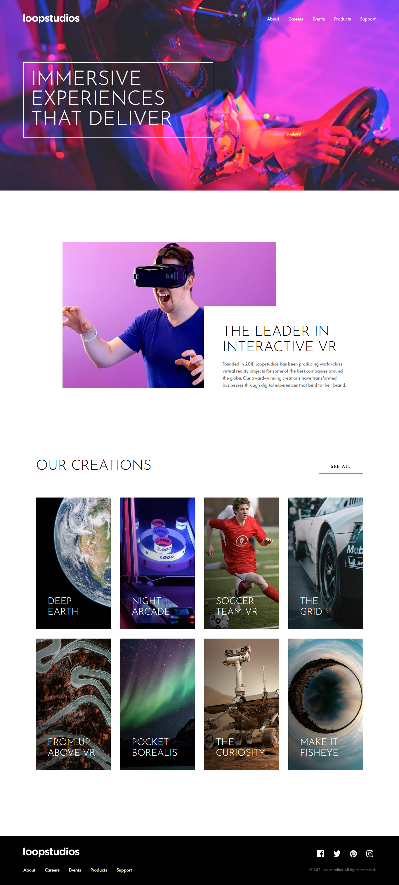

# Frontend Mentor - Loopstudios landing page solution

This is a solution to the [Loopstudios landing page challenge on Frontend Mentor](https://www.frontendmentor.io/challenges/loopstudios-landing-page-N88J5Onjw). Frontend Mentor challenges help you improve your coding skills by building realistic projects.

## Table of contents

- [Overview](#overview)
  - [The challenge](#the-challenge)
  - [Screenshot](#screenshot)
  - [Links](#links)
- [My process](#my-process)
  - [Built with](#built-with)
  - [What I learned](#what-i-learned)
- [Author](#author)

## Overview

### The challenge

Users should be able to:

- View the optimal layout for the site depending on their device's screen size
- See hover states for all interactive elements on the page

### Screenshot

### Links

- Solution URL: [Frontend Mentor Solution](https://www.frontendmentor.io/solutions/loopstudios-landing-page-pzdVK79oj9)
- Live Site URL: [Loopstudios landing page](https://gustavo2023.github.io/loopstudios-landing-page/)

## My process

### Built with

- Semantic HTML5 markup
- CSS custom properties
- Flexbox
- CSS Grid
- Mobile-first workflow
- JavaScript
- Sass
- BEM

### What I learned

- **The Synergy of BEM and Sass:** I learned how to effectively use the Sass parent selector (`&`) to create a nested SCSS structure that perfectly mirrors the BEM classes in the HTML. This approach (`.block { &__element { ... } }`) makes component styles incredibly readable, self-contained, and easy to maintain.

- **Sass for Maintainability:** Centralizing all design tokens (colors, fonts, breakpoints) in a `_variables.scss` file and reusable logic (like media query mixins) in a `_mixins.scss` file creates a single source of truth. This makes the entire project incredibly easy to update and ensures consistency.

- **Accessibility from the Start:** I focused on building an accessible experience from the beginning. This included:
  - Implementing a JavaScript-powered focus trap for the mobile menu to ensure keyboard users can't get "lost" behind the overlay.
  - Using `:focus-visible` for clean, non-intrusive focus states for keyboard navigators.
  - Ensuring the DOM order provides a logical tab sequence for all users.

## Author

- Frontend Mentor - [@gustavo2023](https://www.frontendmentor.io/profile/gustavo2023)
